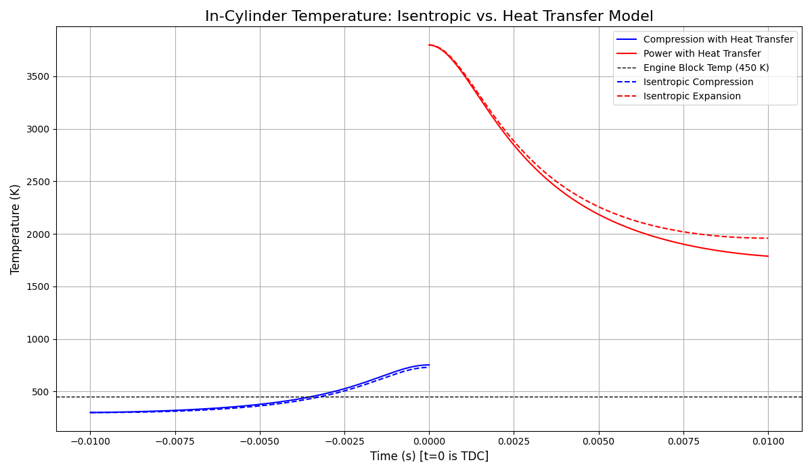

# Otto Cycle Simulation with Heat Transfer

A Python-based numerical model for analyzing the Otto cycle, developed to investigate the impact of real-world heat transfer on the thermodynamic efficiency of an internal combustion engine.



---

## 📝 Introduction

Within most undergraduate thermodynamics courses, the standard method of analyzing thermodynamic processes is to idealize them. Standard assumptions like isentropic work or isobaric heat transfer make calculations manageable, but can lead to a significant discrepancy when real-life examples differ by over 50% of the calculated values. This project was motivated by the desire to bridge this gap by scraping back a layer of idealized simplicity to reveal the more complex workings of a basic thermodynamic work cycle.

This simulation focuses on one of the largest sources of inefficiency in a real engine: **heat transfer** between the hot in-cylinder gas and the cooler engine block.

---

## ✨ Key Features

* **ODE-Based Model:** Uses a SciPy initial value problem solver (`solve_ivp`) to model the engine strokes as a time-dependent process.
* **Realistic Kinematics:** Accurately models the instantaneous cylinder volume, piston speed, and exposed surface area using standard slider-crank kinematics.
* **Heat Transfer Analysis:** Implements a convective heat transfer model to quantify the energy loss through the cylinder walls.
* **Ideal vs. Real Comparison:** Directly compares the results of the heat transfer model against a purely ideal (isentropic) Otto cycle.
* **Variable Properties:** Utilizes the PYroMat library to account for the temperature-dependent properties of air (e.g., specific heats).
* **Real Engine Geometry:** The model is parameterized with the real-world specifications of a production engine (GM LS7 V8).

---

## 🚀 How to Run

This simulation is contained within a single Jupyter Notebook (`Integrator NEW.ipynb`).

### 1. Prerequisites

You will need Python 3 and the following libraries:
* NumPy
* SciPy
* PYroMat
* Matplotlib

### 2. Installation

Clone the repository and install the required packages.

```bash
git clone [https://github.com/zrothman-uncc/Otto-HT-Integrator.git](https://github.com/zrothman-uncc/Otto-HT-Integrator.git)
cd Otto-HT-Integrator
pip install -r requirements.txt
```

### 3\. Execution

Open and run the `Integrator NEW.ipynb` notebook in a Jupyter environment. You can adjust the engine parameters in the "Known Engine Values" cell to simulate different scenarios.

-----

## 📈 Key Findings

The primary finding of this simulation is that **time** is the most critical factor in determining the magnitude of heat loss.

  * At a typical cruise speed of **1500 RPM**, the model calculated a **4.15%** drop in thermal efficiency due to heat transfer.
  * When the engine speed was reduced to **300 RPM**, the efficiency penalty increased dramatically to **12.7%**.

This result confirms that slower-moving engines have a longer time per cycle for heat to escape, significantly impacting their real-world efficiency. These findings align well with established engine theory.

-----

## 🔧 Future Work

This model provides a solid foundation for more advanced analysis. Potential future improvements include:

  * **Woschni Correlation:** Implementing a dynamic heat transfer coefficient instead of a constant `h`.
  * **Wiebe Function:** Modeling combustion as a finite-duration process instead of an instantaneous heat addition.
  * **Pumping Loops:** Adding the intake and exhaust strokes to the model to calculate and include pumping losses.
  * **Friction Model:** Incorporating a model for mechanical friction to provide a more complete picture of brake thermal efficiency.
